# Taller de práctica con uv

Taller práctico para aprender el flujo básico de trabajo con [uv](https://docs.astral.sh/uv/), el gestor de proyectos y paquetes de Python. Consiste en cinco proyectos pequeños, cada uno inicializado y ejecutado desde la terminal con uv.

**Autor:** Darío Sebastián Rivera Sáenz
**Institución:** Universidad Santo Tomás, Seccional Tunja
**Entorno:** Windows · PowerShell · Editor Helix (`hx`)

---

## Requisitos

- [uv](https://docs.astral.sh/uv/getting-started/installation/)
- [Helix](https://helix-editor.com/) (u otro editor de terminal)

Instalación en Windows:

```powershell
winget install --id=astral-sh.uv -e
winget install Helix.Helix
```

Verificar la instalación:

```powershell
uv --version
hx --version
```

> No es necesario instalar Python por separado: uv descarga la versión indicada en `.python-version` si no está disponible.

---

## Estructura del repositorio

```
taller-uv/
├── README.md
├── suma-numeros/
│   ├── main.py
│   ├── pyproject.toml
│   ├── .python-version
│   └── README.md
├── presentacion-personal/
├── edad-futura/
├── area-rectangulo/
└── precio-descuento/
```

Cada proyecto conserva los archivos generados por `uv init`, incluido `pyproject.toml`, que es el archivo de configuración del proyecto.

---

## Flujo de trabajo

El mismo procedimiento se repitió para cada ejercicio:

```powershell
uv init nombre-proyecto   # 1. Crear el proyecto
cd nombre-proyecto        # 2. Entrar a la carpeta
hx main.py                # 3. Editar el archivo principal
uv run main.py            # 4. Ejecutar desde la terminal
cd ..                     # 5. Volver a la carpeta general
```

Creación de la carpeta general del taller:

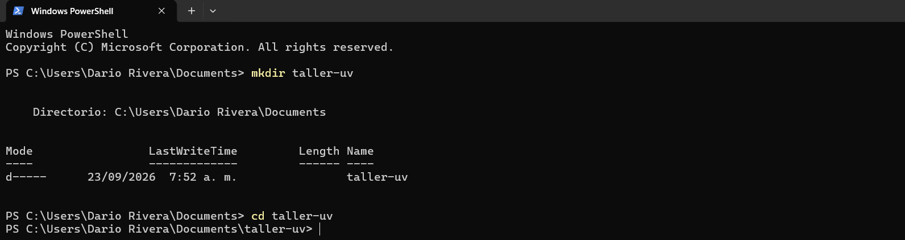

---

## Proyectos

### 1. suma-numeros

Solicita dos números y muestra su suma. Acepta valores enteros y decimales.

```powershell
uv init suma-numeros
cd suma-numeros
uv run main.py
```

| Entrada | Resultado esperado |
|---|---|
| 8 y 5 | 13 |
| 12.5 y 3.5 | 16 |


**Evidencias:**

| Creación | Código en Helix | Ejecución |
|:-:|:-:|:-:|
| 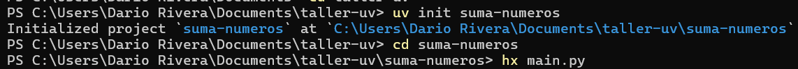 | 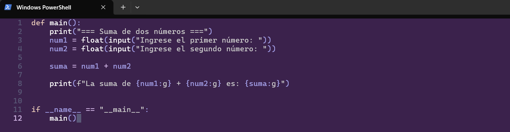 | 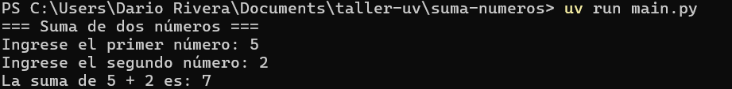 |

### 2. presentacion-personal

Solicita nombre, ciudad y programa académico, y los presenta en una sola frase.

```powershell
uv init presentacion-personal
cd presentacion-personal
uv run main.py
```

| Entrada | Resultado esperado |
|---|---|
| Datos propios | Frase con los datos en orden correcto |
| Otro nombre y otra ciudad | Frase con los nuevos datos |


**Evidencias:**

| Creación | Código en Helix | Ejecución |
|:-:|:-:|:-:|
| 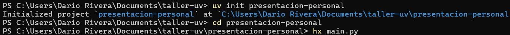 | 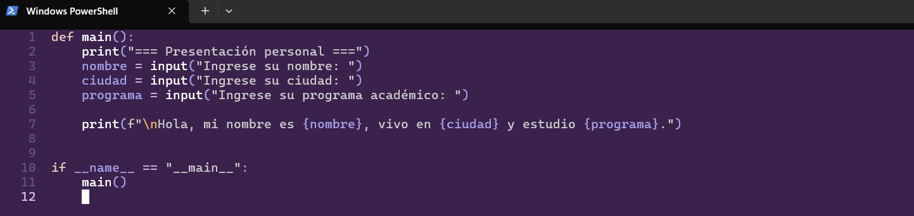 | 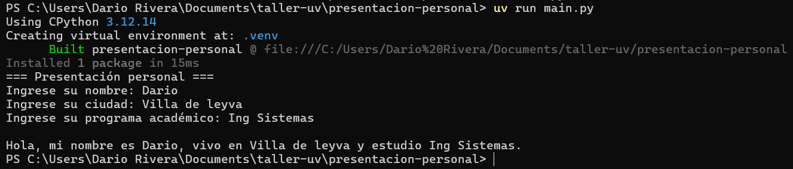 |

### 3. edad-futura

Solicita el nombre y la edad actual, y calcula la edad dentro de cinco años.

```powershell
uv init edad-futura
cd edad-futura
uv run main.py
```

| Edad actual | Edad futura esperada |
|---|---|
| 18 | 23 |
| 25 | 30 |


**Evidencias:**

| Creación | Código en Helix | Ejecución |
|:-:|:-:|:-:|
| 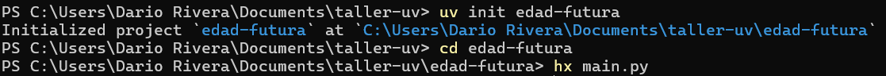 | 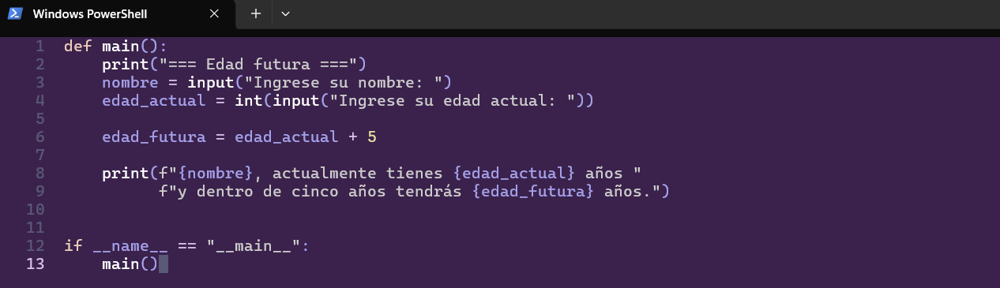 | 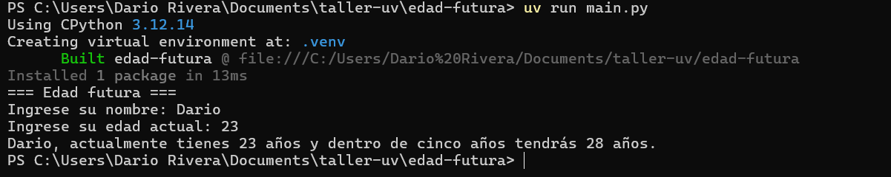 |

### 4. area-rectangulo

Solicita la base y la altura (con decimales) y calcula el área.

```powershell
uv init area-rectangulo
cd area-rectangulo
uv run main.py
```

| Base | Altura | Área esperada |
|---|---|---|
| 6 | 4 | 24 |
| 2.5 | 3 | 7.5 |


**Evidencias:**

| Creación | Código en Helix | Ejecución |
|:-:|:-:|:-:|
| 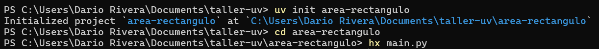 | 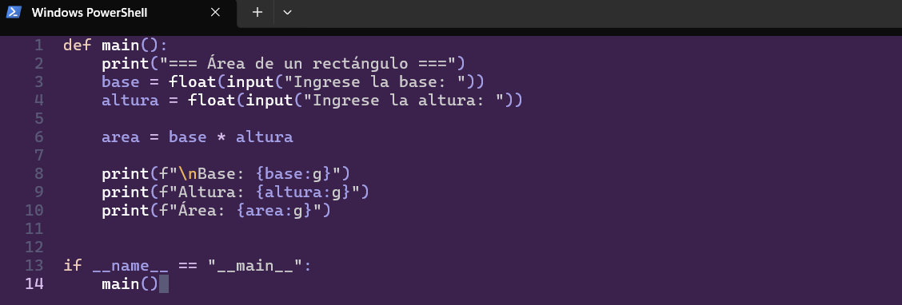 | 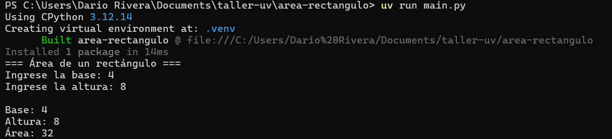 |

### 5. precio-descuento

Solicita el precio de un producto, aplica un descuento del 10 % y muestra el precio final.

```powershell
uv init precio-descuento
cd precio-descuento
uv run main.py
```

| Precio | Descuento esperado | Precio final esperado |
|---|---|---|
| 100000 | 10000 | 90000 |
| 75000 | 7500 | 67500 |


**Evidencias:**

| Creación | Código en Helix | Ejecución |
|:-:|:-:|:-:|
| 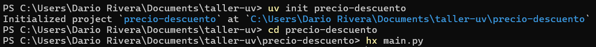 | 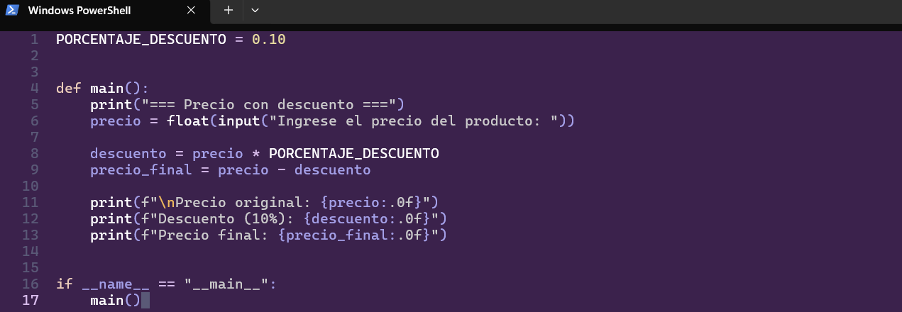 | 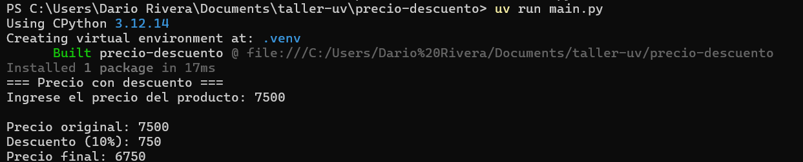 |

---

## Ejecutar todos los proyectos

Desde la carpeta general del taller:

```powershell
foreach ($p in "suma-numeros","presentacion-personal","edad-futura","area-rectangulo","precio-descuento") {
    Write-Host "`n>>> $p" -ForegroundColor Cyan
    uv run --directory $p main.py
}
```

---

## Evidencias

Todas las capturas de creación (`uv init`), edición con Helix y ejecución (`uv run`) están en la carpeta [`evidencias/`](evidencias/) y se muestran en la sección de cada proyecto.